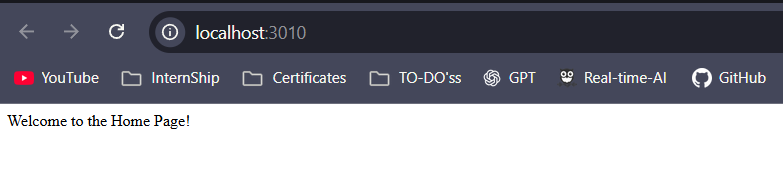
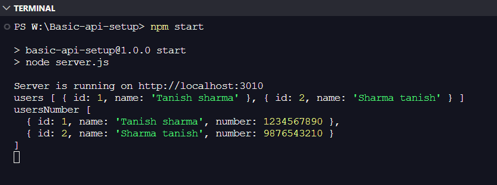

# Basic API Setup

## Snapshots





## Technologies & Libraries

- **Language**: JavaScript
- **Runtime**: Node.js
- **Framework**: Express.js (^5.2.1)
- **Package Manager**: npm

## Project Overview

This repository contains a basic Express.js API server. It demonstrates fundamental REST API operations including GET and POST endpoints with in-memory data storage. The project appears to be for learning or practice purposes.

## Repository Structure

```
.
├── Snapshot         # Snapshots of outputs
├── app.js           # React component file (unused in server setup)
├── server.js        # Main Express server and API routes
└── package.json     # Project metadata and dependencies
```

**File descriptions:**

- `server.js`: Contains the Express application initialization, route definitions, and server startup logic.
- `app.js`: A React component that is not integrated into the server.
- `package.json`: Defines project metadata and the Express dependency.

## Features / Implementations

- Home route returning a welcome message
- Sample GET endpoint (`/api/sample`) returning a hardcoded list of users
- POST endpoint (`/api/users`) for adding new users to an in-memory array
- JSON request body parsing via `express.json()` middleware
- Console logging of server startup and in-memory user data

## Setup & Requirements

**Prerequisites:**

- Node.js installed

**Installation:**

```bash
npm install
```

## Usage

Start the server:

```bash
node server.js
```

The server listens on `http://localhost:3010`.

**Available endpoints:**

- `GET /` - Returns a welcome message
- `GET /api/sample` - Returns a list of hardcoded users
- `POST /api/users` - Accepts JSON body with `name` field and adds a new user

**Example POST request:**

```json
{
  "name": "Tanish Sharma"
}
```

## Scope & Intent

This repository is intended for learning and practice with basic Express.js API development. It is not production-ready.

## Limitations

- All data is stored in-memory and is lost when the server stops
- No data validation on POST requests
- No error handling for invalid inputs
- `app.js` is defined but not used in the server implementation
- Inconsistent port configuration: `PORT` variable is set to 5000 but the server listens on 3010
- No test suite implemented
- Response status code syntax error in POST route (`res.send(201).send(newUser)`)

## Contributing

For contributions, ensure changes maintain consistency with the existing code style and test functionality locally before submitting changes.

## License

ISC
